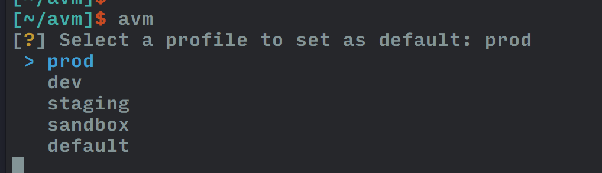

 
# avm

A tool for managing AWS default account, rvm-style.

Usage:

* `avm --add -f ~/Downloads/another_random_AWS_keypair.csv -a alias_that_makes_sense` to pull a profile into ~/.aws/credentials
* `avm --use your-profile-name` to set a profile as default
* `avm` to choose default profile from the list:

Installation:

* `pip install avm`
